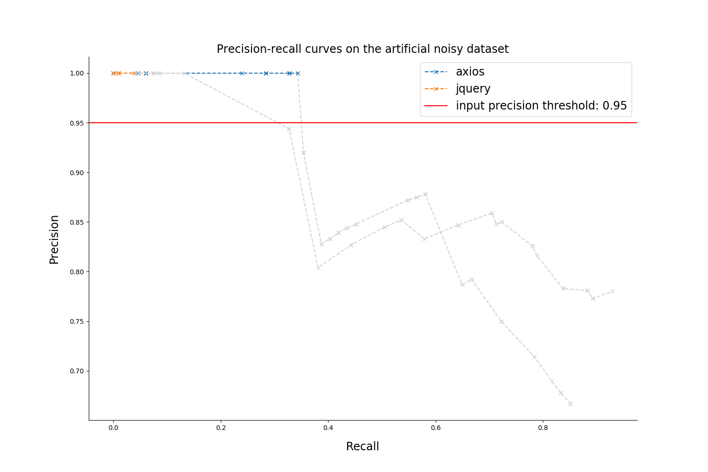

# Quality report on the artificial noisy dataset

### Rules filtering thresholds

* `Confidence: 0  `
* `Support: 80`

### Metrics table

| repository |  number of mistakes  | precision at max recall | empirical confidence threshold |    max recall     |        Number of rules (filtered / overall)          |
|:----------:|:--------------------:|:-----------------------:|:------------------------------:|:-----------------:|:----------------------------------------------------:|
|  axios  | 67 |  0.667 |  0.99  | 0.851 | `159 / 159` |
|  jquery  | 106 |  0.78 |  0.99  | 0.929 | `83 / 83` |

### Precision-recall curves

