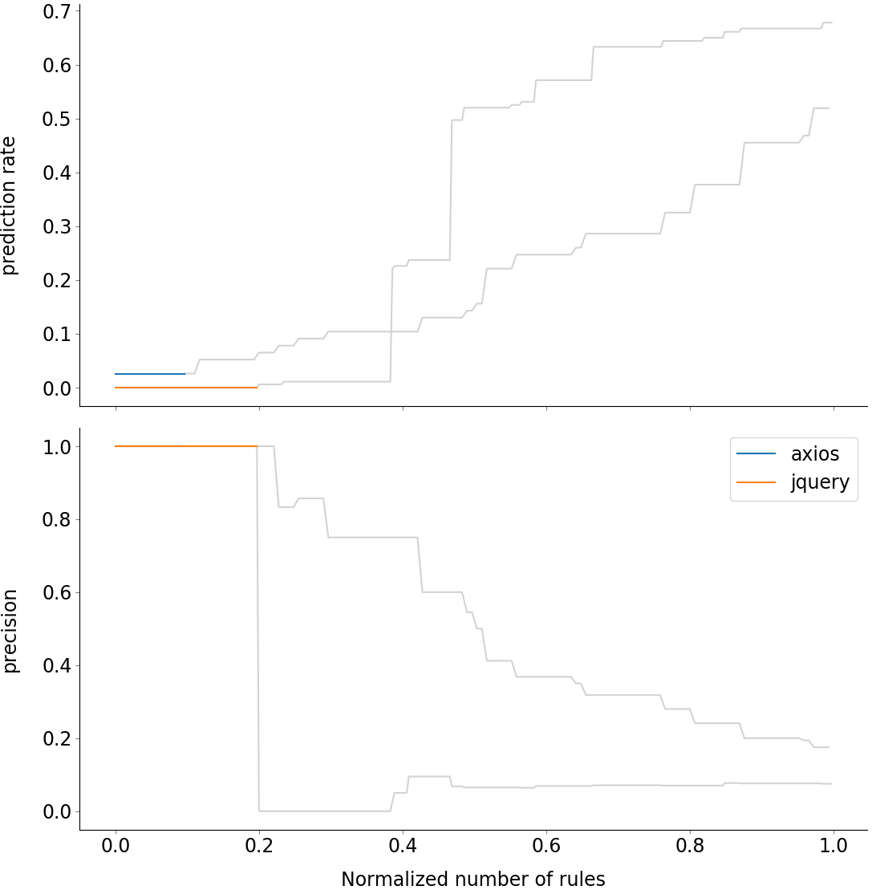

# Quality report on the artificial noisy dataset

### Rules filtering thresholds

* `Confidence: 0  `
* `Support: 80`

### Metrics table

| repository |  number of mistakes  | precision at max recall | empirical confidence threshold |    max recall     |        Number of rules (filtered / overall)          |
|:----------:|:--------------------:|:-----------------------:|:------------------------------:|:-----------------:|:----------------------------------------------------:|
|  axios  | 77 |  0.175 |  1.0  | 0.519 | `145 / 145` |
|  jquery  | 177 |  0.075 |  1.0  | 0.678 | `350 / 350` |

### Precision-recall curves

