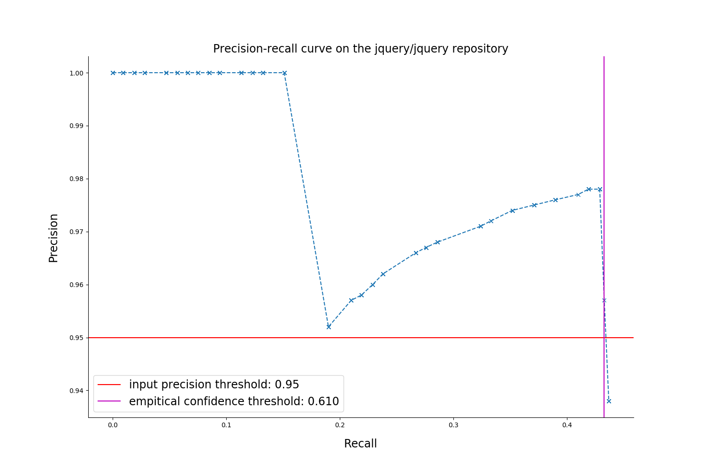

# Quality report on the artificial noisy dataset

### Rules filtering thresholds

* `Confidence: 0.0  `
* `Support: 80`

### Metrics table for the *jquery/jquery* repository
  

| number of mistakes | recall at threshold precision | precision at max recall | empirical confidence threshold | max recall  |             Number of rules              |
|:------------------:|:-----------------------------:|:-----------------------:|:------------------------------:|:-----------:|:----------------------------------------:|
|   106   |     0.433    |     0.938    |  0.61  | 0.437 | `329 / 828` |

